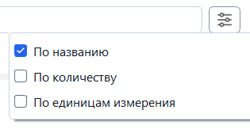

# 📦 Stockwise

> Russian version available: README_RU.md

[]()
[]()
[]()
[]()
[]()


**Stockwise** is a desktop application designed to collect and consolidate materials from Excel-based product specifications, calculate required material quantities, and generate production documents such as **Memos** and **Requests**.  
It is intended for engineers, technologists, and planning specialists working with large structured product datasets.

---

## 🖼 Screenshots

### Main Window — Product Search  


### Document Generation Window  


---

## What's New (v2.2.0)

### ✨ New Features
- **Added checkboxes for table rows**  
Now you can choose specific items to export.
- **Introduced search filters**  
Configure which column of the table to search (by name, quantity, units of measurement)



### 🖼️ Design
- Updated the overall appearance of the table.
- Swapped the positions of the Export and Create document buttons for more intuitive access.
- Redesigned the search popup for better clarity and usability.
- Minor improvements to various UI elements.

### 🐞 Bug Fixes
- Fixed localization issues across the interface.
- Resolved a bug where the document creation button wouldn’t deactivate during export.

---

## 📘 Overview

**Stockwise** is a desktop application for engineers, technologists, and production planners.  
The program collects materials from Excel product specifications, combines the same items, calculates the demand for the selected production volume and exports the final report to an **Excel** document.

Stockwise also supports generating two types of documents:

- **Memos**  
- **Requests**

Both document types support:

- customizable signatures (from whom/to whom)
- separate black and white lists  
- automatic formatting

---

## 🎯 Key features

### Search
- Search by product name  
- Partial match  
- Configurable search filters (name, quantity, units)

#### Content search mode
The program allows you to search **within the materials of the selected product**, and not just by product names.

- Check box: `[ ] Search for materials`  
- After selecting a product (for example, *BKN.0.12*):
`[✓] Search for materials — BKN.0.12`  
- The search is performed only by the nomenclature within the specification of the selected product  
- Convenient for large specifications with dozens of Excel files  

### Automatic specification pooling
- Reading attached Excel files  
- Combining identical items  
- Automatic summation of quantities  

### Calculation of norms for volume
- Quick recalculation of needs for any planned product release 

### Document generation
- Formation of **Memos** and **Applications**  
- Automatic filling of product information  
- Customizable signatures (from whom/to whom)
- Support for black and white lists  

### Export to Excel
- Export of summary materials  
- Export of generated documents  
- `.xlsx` format  
- Selection-based export using row checkboxes

### Auto-update system
- Checking the version of the program on the server  
- Offer updates if a new version is available  

### Modern PyQt5 interface
- Fast navigation  
- Clear structure  
- Error messages and statuses  

---

## 📁 How it works

Stockwise uses the storage structure specified in `config.yaml'.

### 1. The root folder  
It stores product groups.

### 2. Product folder  
Each product is a set of subfolders.  
Example:
```
\Stockwise\БКН.0.12\.xlsx
```

### 3. Specification files  
The destination folder should contain:
- `.xlsx` files  
- Each file must have a **TDSheet**

### 4. Required Columns (TDSheet)
- **Nomenclature** — name of the material  
- **Quantity** — the amount of demand  
- **Units** — unit of measurement  

### 5. Configuration (config.yaml)
Contains:

- The path to the product folder  
- The path to the server version of the program  
- Program name
- Program version
- Signatures  
- Black and white lists  

---

## 🛠 Installation

### 1. Clone repository
```bash
git clone https://github.com/pntech-dev/Stockwise.git
cd Stockwise
```

### 2. Create virtual environment
```bash
python -m venv venv
venv\Scripts\activate
```

### 3. Install dependencies
```bash
pip install -r requirements.txt
```

### 4. Configure `config.yaml`
Set:
- path to product folder  
- server program path  
- signatures  
- blacklists / whitelists  

---

## 🏗 Project build (PyInstaller)

The **Stockwise.spec** file is used to build the program.

### 1. Installing PyInstaller
```bash
pip install pyinstaller
```

### 2. Building the app
Run the command in the root of the project:

```bash
pyinstaller Stockwise.spec
```

### 3. Actions by Stockwise.spec
- generates an executable file Stockwise.exe
- includes the necessary files and folders in the assembly:

  - config.yaml
  - file with version information
  - updater.exe
  - templates/
- automatically copies these resources to the final directory after the build

### 4. The final structure
After the build, a directory is created:
```
dist/
 └── Stockwise/
      ├── Stockwise.exe
      ├── config.yaml
      ├── version file
      ├──updater.exe ,
      ├── templates/ <- document templates
      └── _internal <- service files
```

---

## ⚙ Tech Stack
- Python 3.10  
- PyQt5  
- Pandas  
- openpyxl  
- MVC architecture (Model-View-Controller)  

---

## 📄 License

MIT License

Copyright (c) 2025 Pavel (PN Tech)

Permission is hereby granted, free of charge, to any person obtaining a copy of this software and associated documentation files...

---

## 🧑‍💻 Author

**Pavel (PN Tech)**  
Python desktop and web developer, UI/UX designer, electronics engineer  
