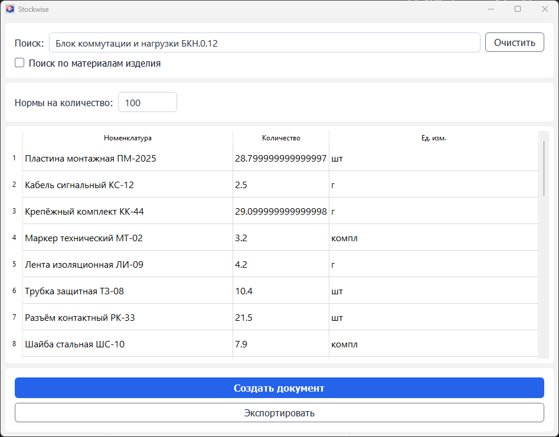
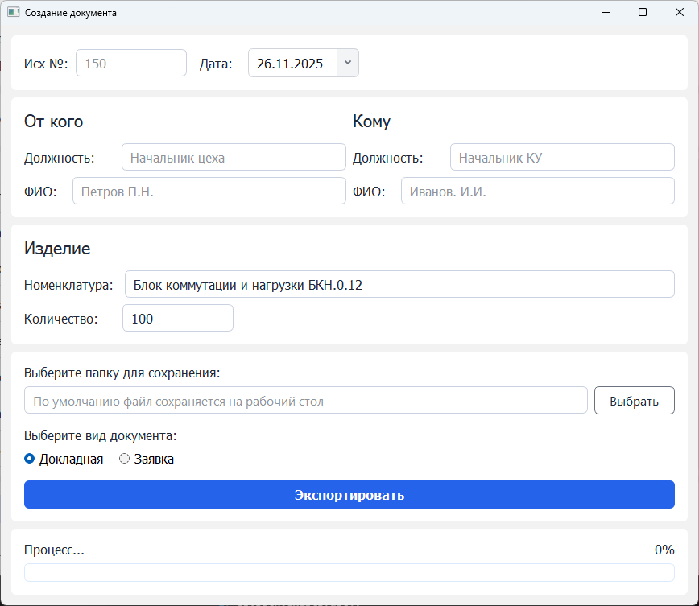

# 📦 Stockwise

> English version: см. README.md

[]()
[]()
[]()
[]()
[]()


**Stockwise** — это настольное приложение, предназначенное для сбора и объединения материалов из спецификаций продуктов в формате Excel, расчета необходимого количества материалов и создания производственных документов, таких как **Докладная записка** и **Заявка**.  
Оно предназначено для инженеров, технологов и специалистов по планированию, работающих с большими структурированными наборами данных о продуктах.

---

## 🖼 Скриншоты

### Главное окно — Поиск изделий  


### Окно генерации документов  


---

## 📘 Обзор

**Stockwise** — это настольное приложение для инженеров, технологов и специалистов по планированию производства.  
Программа собирает материалы из Excel‑спецификаций изделия, объединяет одинаковые позиции, рассчитывает потребность для выбранного объёма производства и экспортирует итоговый отчёт в **Excel** документ.

Приложение также позволяет формировать два вида документов:

- **Докладная записка**
- **Заявка**

Документы поддерживают:

- настраиваемые подписи (от кого / кому)
- отдельные чёрные и белые списки  
- автоматическое форматирование  

---

## 🎯 Основные возможности

### Поиск
- Поиск по названию изделия  
- Частичное совпадение   

#### Режим поиска материалов
Программа позволяет выполнять поиск **внутри материалов выбранного изделия**, а не только по названиям изделий.

- Флажок: `[ ] Поиск по материалам`  
- После выбора изделия (например, *БВВ.01*):  
  `[✓] Поиск по материалам — БВВ.01`  
- Поиск выполняется только по номенклатуре внутри спецификации выбранного изделия  
- Удобно для больших спецификаций с десятками Excel‑файлов  

### Автоматическое объединение спецификаций
- Чтение вложенных Excel‑файлов  
- Объединение одинаковых номенклатур  
- Автоматическое суммирование количеств  

### Расчёт норм на объём
- Быстрый перерасчёт потребности под любой планируемый выпуск продукции 

### Генерация документов
- Формирование **Докладных записок** и **Заявок**  
- Автоматическое заполнение информации об изделии  
- Настраиваемые подписи (от кого / кому)
- Поддержка чёрных и белых списков  

### Экспорт в Excel
- Экспорт сводных материалов  
- Экспорт сформированных документов  
- Формат `.xlsx`  

### Система автообновления
- Проверка версии программы на сервере  
- Предложение обновления при наличии новой версии  

### Современный интерфейс PyQt5
- Быстрая навигация  
- Чёткая структура  
- Сообщения об ошибках и статусах  

---

## 📁 Как это работает

Stockwise использует структуру хранения, задаваемую в `config.yaml`.

### 1. Корневая папка  
Хранит в себе группы изделий.

### 2. Папка изделия  
Каждое изделие — это набор вложенных папок.  
Пример:  
```
\Stockwise\БВВ.01\.xlsx
```

### 3. Файлы спецификаций  
В конечной папке должны находиться:
- `.xlsx` файлы  
- Каждый файл должен иметь лист **TDSheet**

### 4. Обязательные столбцы (TDSheet)
- **Номенклатура** — название материала  
- **Количество** — величина потребности  
- **Ед. изм.** — единица измерения  

### 5. Конфигурация (config.yaml)
Содержит:

- Путь к папке с изделиями  
- Путь к серверной версии программы  
- Название программы
- Версия программы
- Подписи  
- Чёрные и белые списки  

---

## 🛠 Установка

### 1. Клонирование репозитория
```bash
git clone https://github.com/pntech-dev/Stockwise.git
cd Stockwise
```

### 2. Создание виртуального окружения
```bash
python -m venv venv
venv\Scripts\activate
```

### 3. Установка зависимостей
```bash
pip install -r requirements.txt
```

### 4. Настройка `config.yaml`
Указать:
- путь к изделиям  
- путь к серверной версии программы  
- подписи  
- чёрные/белые списки  

---

## 🏗 Сборка проекта (PyInstaller)

Для сборки программы используется файл **Stockwise.spec**.

### 1. Установка PyInstaller
```bash
pip install pyinstaller
```

### 2. Сборка приложения
Выполните команду в корне проекта:

```bash
pyinstaller Stockwise.spec
```

### 3. Действия Stockwise.spec
- формирует исполняемый файл Stockwise.exe
- включает в сборку необходимые файлы и папки:

  - config.yaml
  - файл с информацией о версии
  - updater.exe
  - templates/
- автоматически копирует эти ресурсы в итоговую директорию после сборки

### 4. Итоговая структура
После сборки создаётся директория:
```
dist/
 └── Stockwise/
      ├── Stockwise.exe
      ├── config.yaml
      ├── файл версии
      ├── updater.exe
      ├── templates/ <- шаблоны документов
      └── _internal <- служебные файлы
```

---

## ⚙ Технологии
- Python 3.10  
- PyQt5  
- Pandas  
- openpyxl  
- MVC‑архитектура (Model-View-Controller) 

---

## 📄 Лицензия

MIT License

Copyright (c) 2025 Pavel (PN Tech)

---

## 🧑‍💻 Автор

**Pavel (PN Tech)**  
Python desktop и web разработчик, UI/UX дизайнер, инженер-электроник